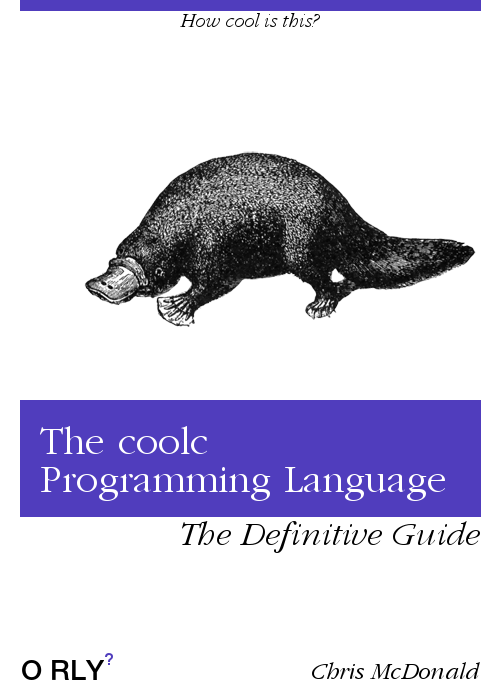

# CITS2002 Project 1

**Due date: 11:59pm Friday 17th September (end of week 7)**

**Grade weighting: 25%**

  

Work in progress!

Will emulate a simple 16-bit computer to execute programs compiled in the esoteric programming language *cool*.

## Useful Links:

Project info:
 + [project explanation](http://teaching.csse.uwa.edu.au/units/CITS2002/projects/project1.php)
 + [project clarifications](http://teaching.csse.uwa.edu.au/units/CITS2002/projects/project1-clarifications.php)

*cool* language info:
 + [cool syntax](http://teaching.csse.uwa.edu.au/units/CITS2002/projects/coolsyntax.php)
 + [cool instruction set](http://teaching.csse.uwa.edu.au/units/CITS2002/projects/coolinstructions.php)
 + [cool test files](https://secure.csse.uwa.edu.au/run/coolc)

Misc.: 
 + [help2002](https://secure.csse.uwa.edu.au/run/help2002)
 + [submission location](https://secure.csse.uwa.edu.au/run/cssubmit) (only one member needs to submit)

## Todo

 + [ ] Create todo list
 + [ ] Add name and student numbers to code comment

